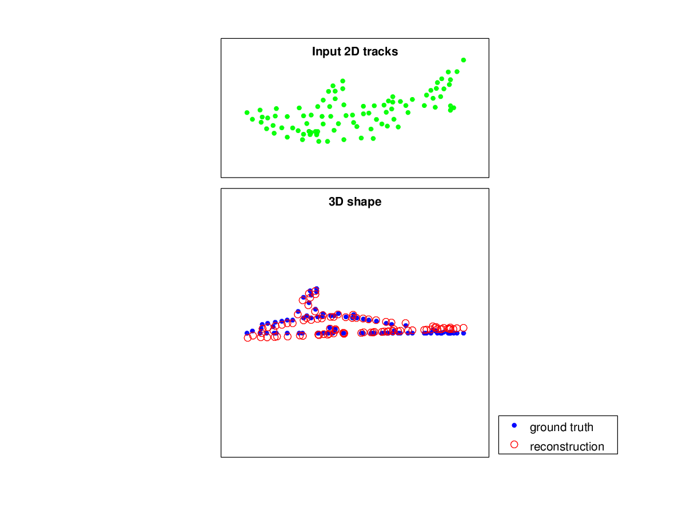

======
em-sfm
======

`Lorenzo Torresani's <http://www.cs.dartmouth.edu/~lorenzo/software.html>`_ Structure from Motion Matlab code

I have cleaned up the C-code so that is is GCC compilable for Matlab and GNU Octave.

Tested in Matlab R2015a and Octave 4.0 on Linux

.. contents::

Examples
========
::

    randomshapes_demo.m

    shark_demo.m 
    
(plot is from GNU Octave 4.0)

Installation
============
from Matlab/Octave Command Window, type::
 
  mex computeH.c

Reference
=========
Non-Rigid Structure From Motion with Gaussian/LDS Deformation Model

Copyright (c) by Lorenzo Torresani, Stanford University

Based on the following paper:

Lorenzo Torresani, Aaron Hertzmann and Christoph Bregler, 
Learning Non-Rigid 3D Shape from 2D Motion, NIPS 16, 2003
http://cs.stanford.edu/~ltorresa/projects/learning-nr-shape/
